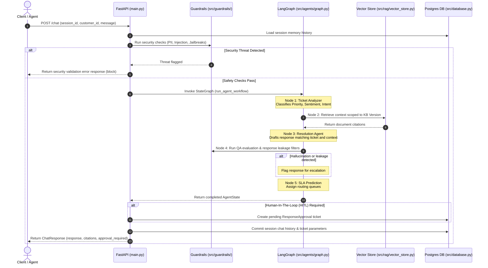

# Enterprise Architecture Blueprint

This document details the high-level system architecture, multi-agent coordination workflow, and request sequence loops for **SupportGPT Enterprise**.

---

## 🏗️ System Component Architecture

The platform follows a clean, decoupled design separating the client browser, API endpoint gateways, safety guardrails layer, agent states graph, databases, and third-party SaaS tools.

```mermaid
graph TD
    User([Support Agent / Customer]) -->|HTTP / JSON| API[FastAPI Gateway]
    
    subgraph Security Layer
        API -->|1. Sanitize| GR[Guardrails Engine]
        GR -->|PII Scrubbing| PII[pii_detection.py]
        GR -->|Injection Check| INJ[prompt_injection.py]
        GR -->|Jailbreak Block| JBL[jailbreak_detection.py]
    end
    
    subgraph Multi-Agent Graph (LangGraph)
        GR -->|2. Invoke Flow| LG[StateGraph Orchestrator]
        LG --> Node1[Analyzer Node]
        LG --> Node2[Retriever Node]
        LG --> Node3[Resolver Node]
        LG --> Node4[QA Validator Node]
        LG --> Node5[Escalation/SLA Node]
    end

    subgraph RAG & Data Stores
        Node2 -->|Semantic search| VS[(ChromaDB Vector Store)]
        Node5 -->|Save state / HITL| DB[(PostgreSQL Database)]
        LG -->|Session Caching| Cache[(Redis Cache)]
    end
    
    subgraph External Tools
        Node2 -->|Lookup invoice| CRM[Mock CRM Tool]
        Node2 -->|Lookup details| OM[Mock Order Management]
    end
```

---

## 🔄 Execution Sequence Loop

The diagram below maps the workflow when a customer submits a ticket to `POST /chat`.



---

## 📊 Deployment Topology

For details regarding Kubernetes topology and Docker compose deployment layers, please consult the [Deployment Guide](DEPLOYMENT_GUIDE.md).
